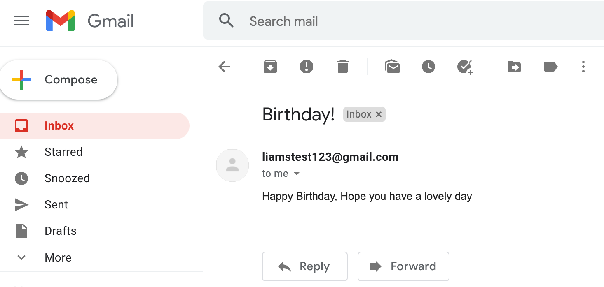

# birthday-api
An API using Node and Express for storing data of, and sending birthday greetings. The aim of this was to focus on displaying maintainability, re-usability, and testability of a simple API.

Coupling has been minimised and Modularity has been maximised by trying to use the single-responsibility principle and dependency injection wherever possible.

Please note that there has been no focus on security, auth, or data reliability as this is a simple proof of concept.

## General overview
I have tried to split up responsibility into three key areas:

[/providers](./providers/) are used to interact with data stores and external services. In this case a local data store and email.

[/services](./services/) handle logic for their specific service, separate from routing, databases, etc.

[/validators](./validators/) handle validation of input data


## Install dependencies
```
npm i
```
Node version used: 15.1.0

NPM version used: 7.0.8

## Test
```
npm run test
```


Mocked tests using Jest and SuperTest can be found in [/tests](./tests/)

## Dev
```
npm run dev
```
[A Postman Collection](./birthday_api.postman_collection.json) has been provided for convenience

## Email
 [The email provider](./providers/messengers/email.js) has been very hastily put together, using an un-secure auth method that is being removed by gmail in May 2022. But worked to prove the concept.
 


